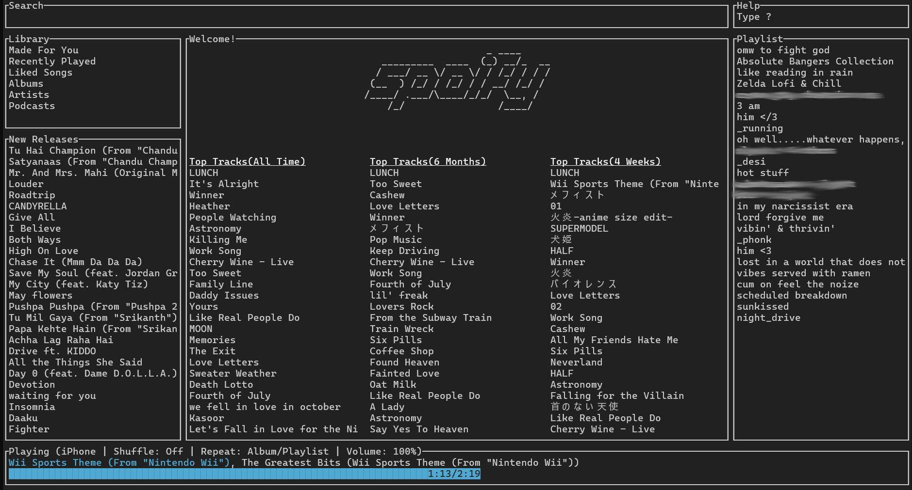
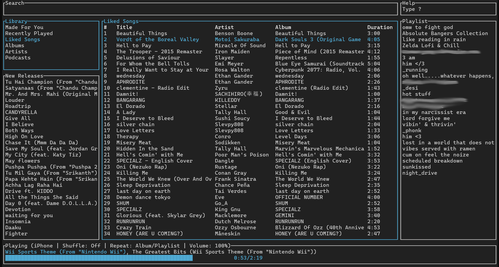

# Spoify
This is a Rust project that implements a Spotify client within your terminal. It allows you to browse and interact with Spotify directly from the command line.

## Connecting to Spotify's API
In order for `spoify` to work it needs to be connected to Spotify's API.
### Instruction
1. Go to the [Spotify dashboard](https://developer.spotify.com/dashboard/applications)
2. Click `Create an app`
    - You now can see your `Client ID` and `Client Secret`
3. Now click `Edit Settings`
4. Add `http://localhost:8888/callback` to the Redirect URIs
5. Scroll down and click `Save`
6. You are now ready to authenticate with Spotify!
7. Go to the `spoify` folder, and inside `configure` folder go to `creds.yml`.
8. Enter you `Client ID` and `Client Secret`.
9. Run `spoify`
10. You will be redirected to an official Spotify webpage to ask you for permissions.
11. After accepting the permissions, you'll be redirected to localhost. You'll be redirected to a blank webpage that might say something like "Connection Refused" since no server is running. Regardless, copy the URL and paste into the prompt in the terminal.

There we go, now you can use `spoify`.
## Configuration
You can go to the configure folder and change the theme, keybindings and other related settings of the application.
## Limitations
This app uses the [Web API](https://developer.spotify.com/documentation/web-api/) from Spotify, which doesn't handle streaming itself. So you'll need an official Spotify app open in order to play tracks.

If you want to play tracks or control the playback part, Spotify requires that you have a Premium account.
## Libraries used
- [rspotify](https://github.com/ramsayleung/rspotify)
- [ratatui](https://github.com/ratatui-org/ratatui)

